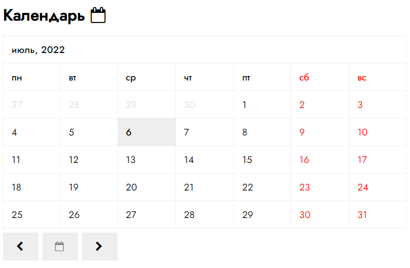

# Класс календаря "Pcalendar"

Календарь на месяц с возможностью переключения на другие. По-умолчанию отображается текущий месяц с выделением сегодняшней датой.

[Демонстрация](https://mchlv.ru/pcalendar/)



## Подключение
1. Блок календаря должен иметь класс ```.pcalendar```
    ```html
    <div class="pcalendar cal_1"></div>
    ```
2. dsd
    ```javascript
    let cal = new Pcalendar('#calendar_1');
    ```